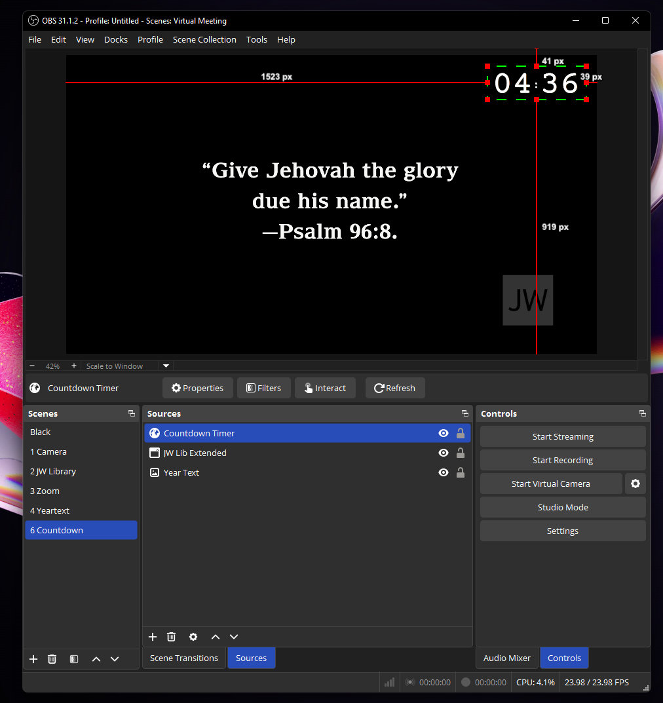
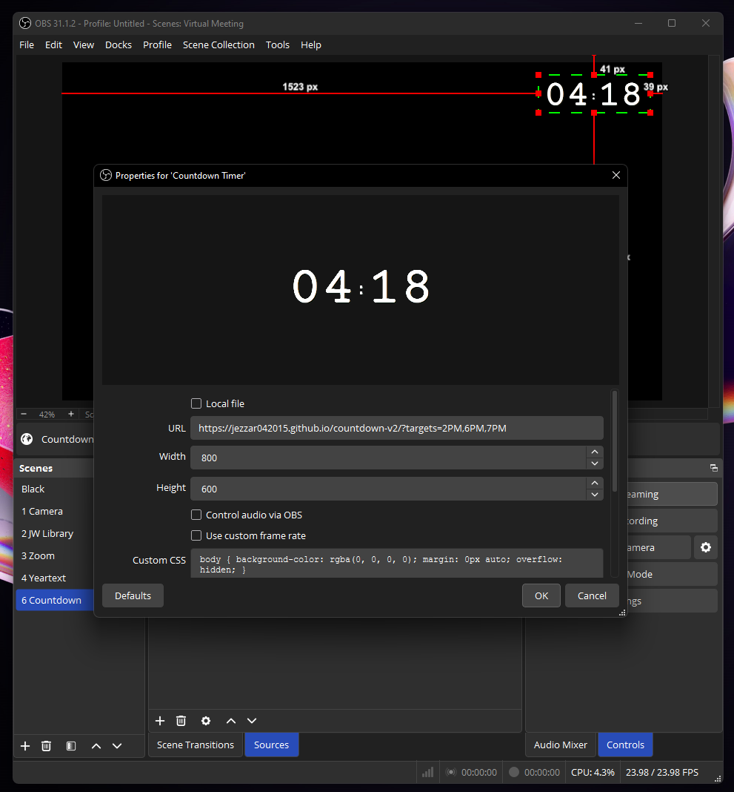

# KH Countdown Timer

### Usage
This timer can be integrated into an OBS preview for Kingdom Hall meetings. Simply add the app URL as a Browser Source in OBS.

The timer’s background is set to green by default, making it easy to apply chroma key and render it transparent.



### Setting the Meeting Times

If no meeting times are set, the default times are 2:00 PM and 6:00 PM. To change the default times, add them to the URL:

```
?targets=#meeting times separated by commas#
```

For example:

```
https://jezzar042015.github.io/countdown-v2/?targets=2PM,9AM,6PM
```



The app will automatically count down to the nearest time specified in the targets list.